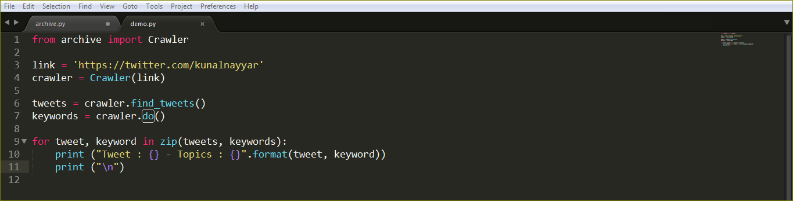
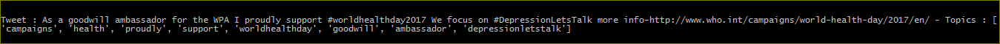
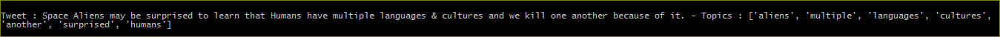

# TweetCrawler
A simple Python library to crawl tweets from any handle and then extract the topic.

#### This project requires **Python 2.7** and the following Python libraries installed:

- urllib2
- BeautifulSoup (bs4)
- re
- rake_nltk

### Usage

### Results

